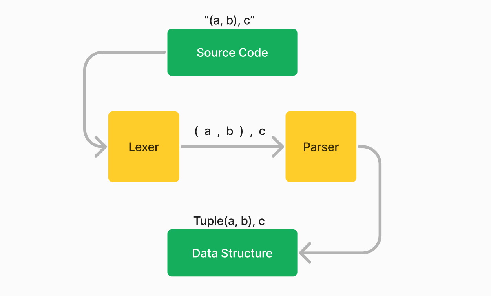

# Overview of Concepts

`Parsing` refers to the process of analyzing text (the source code)
and creating a data structure that is easier to work with.
There are 3 main stages in parsing:
1. **Lexical Analysis**: Breaks the source code into tokens like keywords, identifiers, literals, etc.
   For example, the input "struct Foo;" may be broken down to `struct`, `Foo`, and `;`.
2. **Syntax Analysis**: Checks the structure of the tokens to see if they form a valid syntax.
   For example, `struct Foo;` is valid Rust, but `struct;` is not.
3. Semantic and other checks: This can involve type checking, name resolution, etc.
   Teleparse offers some support for this through semantic tokens and hooks, but it's not the main focus.

The book will go through how to use `teleparse` for each stage.
